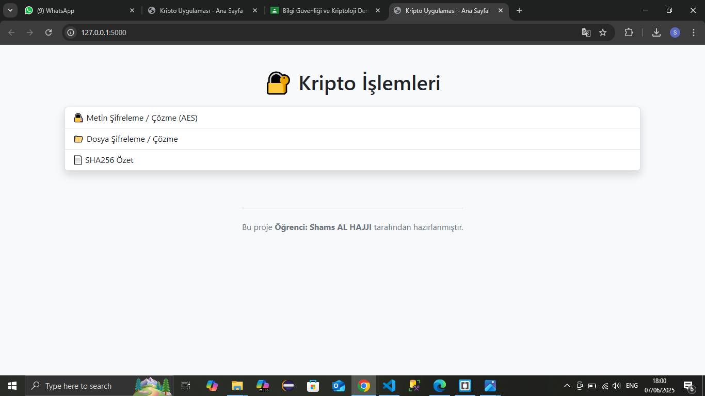
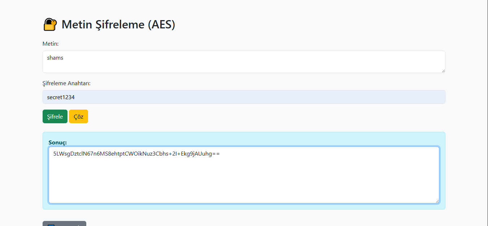
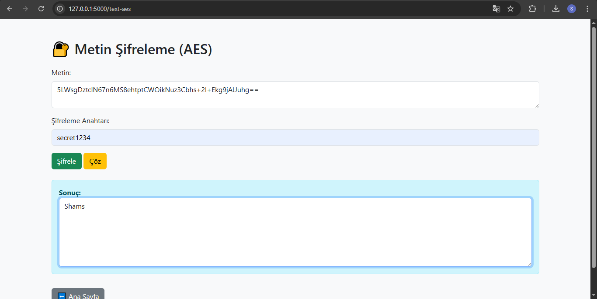
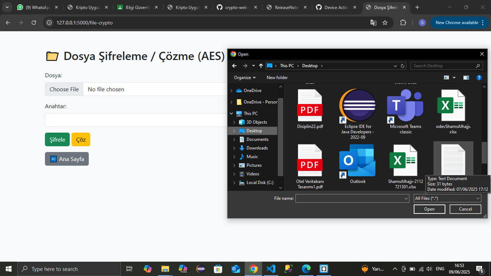
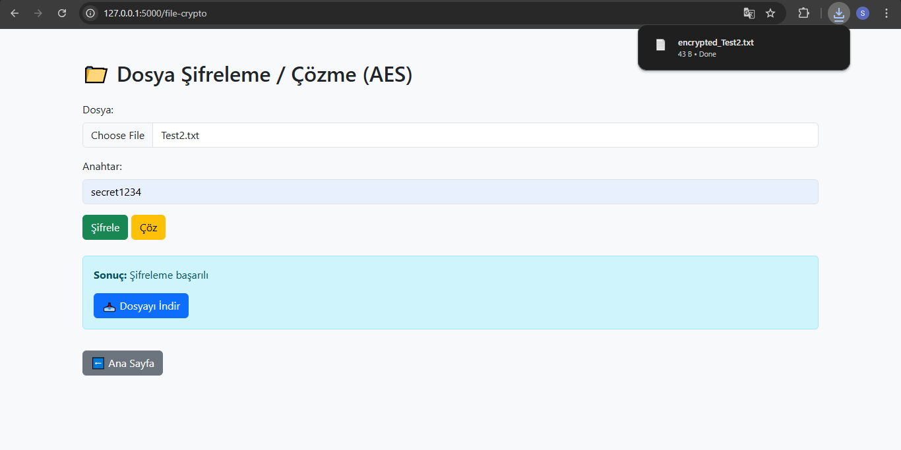
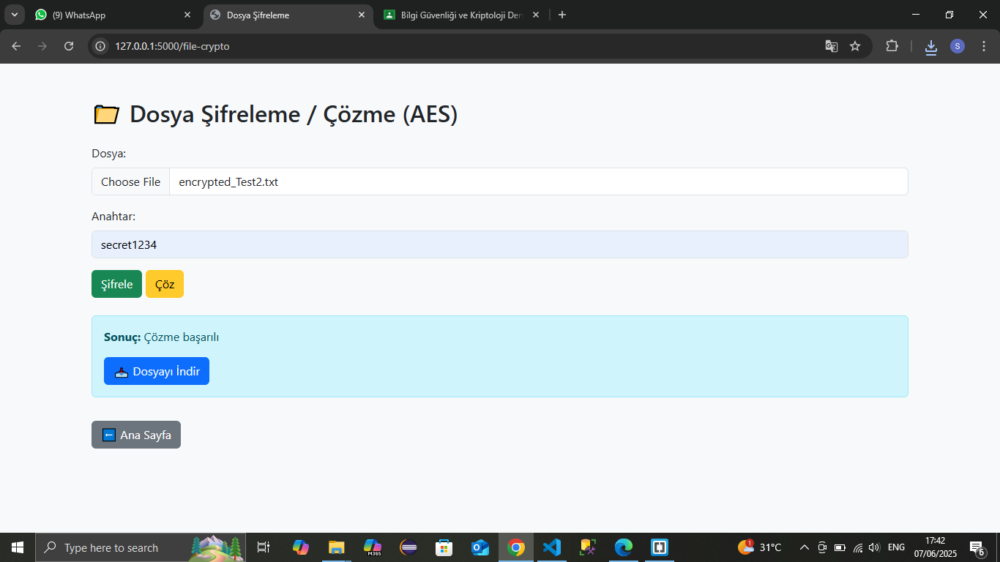
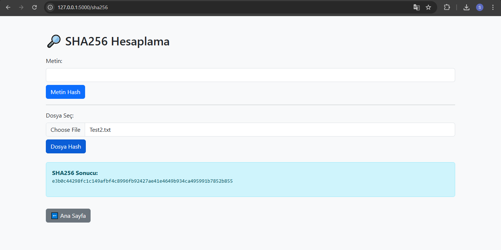

#  AES Tabanlı Kripto Uygulaması (Flask)

Bu proje, AES şifreleme yöntemi ve SHA256 özet fonksiyonu kullanılarak geliştirilen bir web tabanlı kripto uygulamasıdır. Uygulama Python dili ve Flask framework'ü ile yazılmıştır.

##  Özellikler

-  **AES Metin Şifreleme / Çözme**  
  Kullanıcıdan alınan metin, AES algoritması ile şifrelenip çözülebilir.

-  **Dosya Şifreleme / Çözme (AES)**  
  Yüklenen dosyalar AES algoritması ile şifrelenip, indirilebilir hale getirilir. Aynı şekilde çözme işlemi yapılabilir.

-  **SHA256 Metin ve Dosya Özeti**  
  Girilen metnin veya yüklenen dosyanın SHA256 özeti hesaplanabilir.

##  Kullanılan Teknolojiler

- Python
- Flask
- HTML & Bootstrap 5
- PyCryptodome kütüphanesi

##  Kurulum ve Çalıştırma

```bash
pip install flask pycryptodome
python app.py
```

Tarayıcıda aç:  
http://127.0.0.1:5000/

##  Ana Sayfa

Ana Sayfa:



Uygulamanın ana menüsüdür. Kullanıcı buradan metin şifreleme, dosya şifreleme, SHA256 özeti gibi işlemleri seçebilir.

## Metin Şifreleme / Çözme (AES) :

### Metin Şifreleme (AES) :


### Metin Çözme (AES) :



Bu sayfada kullanıcı, istediği metni AES algoritması ile şifreleyebilir veya daha önce şifrelenmiş bir metni çözebilir. Şifreleme işlemi için bir anahtar (şifre) girilmesi gerekir.

##  Dosya Şifreleme / Çözme (AES)

###  1. Dosya Yükleme Arayüzü



Kullanıcı bu alandan şifrelemek veya çözmek istediği dosyayı seçer ve şifreleme anahtarını girer.

---

###  2. Şifreleme Sonucu



Şifreleme işlemi başarılı olduğunda, kullanıcıya şifrelenmiş dosyayı indirme bağlantısı sunulur.

---

###  3. Çözme Sonucu



Kullanıcı doğru anahtarı girerek dosyanın şifresini başarıyla çözebilir ve çözülen dosyayı indirebilir.

##  SHA256 Metin ve Dosya Özeti

###  1. Metin Hash İşlemi


Kullanıcı bu alana bir metin girerek, SHA256 algoritmasıyla özet (hash) değerini oluşturabilir.

---

###  2. Dosya Hash İşlemi



Kullanıcı bir dosya yükleyerek SHA256 özetini alabilir. Sistem, dosyanın içeriğine göre benzersiz bir hash üretir.


##  Geliştirici

**Öğrenci: Shams AL HAJJI**  


---

##  Proje Yapısı

```
├── app.py
├── templates/
│   ├── index.html
│   ├── text_aes.html
│   ├── file_crypto.html
│   └── sha256.html
├── uploads/
└── README.md
```
